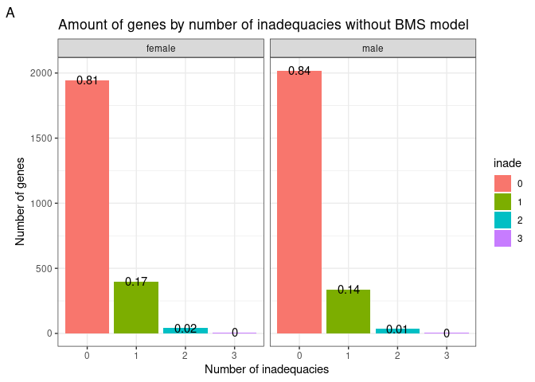

# Analysis of Heliconius Butterflies adequacy data

------------------------------------------------------------------------

## Introduction

The data set is taken from a
[paper](https://academic.oup.com/genetics/article/213/2/581/5930581?login=true)
studying gene expression data in eye and brain tissue in butterfly
species by Catalan et al. The paper primarily uses two models; Brownian
Motion and Ornstein-Uhlenbeck, to elucidate how much the processes of
Drift and Directional Selection contribute to differences in gene
expression levels between the five studied species. They found that
Drift (modeled by Brownian Motion) was the dominant evolutionary process
in this taxa, and specifically single-rate BM. They then studied
Directional Selection by modeling “branch-shift” BM and OU, where the
evolutionary rate changes among branches (also known as multi-rate BM or
OU); of which they found 16% of the data can be explained in this
manner. My analysis will assess how well the evolutionary models can
explain the data, and if they are appropriate for this analysis.

## Summary Analysis

``` r
figure1
```

<!-- -->

``` r
figure1b
```

<!-- -->

**Figure 1: Using the best-fit model (chosen by AIC) shows a high
adequacy for the data set, with only 1 or 2 inadequacies.** A) Total
adequacy without including the BMS model. B) Total adequacy including
the BMS model. Adequacy does not seem to change at all with including
another model to the analysis.

Overall, the data set is quite adequate, with only \~19% of genes for
males and \~16% of genes for females showing inadequacy. Adding a “rate
shift” BM model did not seem to impact the overall data adequacy much.

## Results

### Initial Arbutus Analysis


**Figure 2. Relative fit (left) and absolute fit (right) of the data.**
Overall, a BM model fits the data the best in a relative sense, and in
an absolute sense the best-fit model is quite adequate. The only test
statistics showing a meaningful inadequacy are s.asr and s.var.

After initial analysis, I hypothesized that adding a multi-rate model to
the analysis would increase the fit of the data, due to inadequacies in
s.asr and s.var, which were shown to have increased values under 0.05
when the true model is BMS and a single-rate model is fit in my other
analysis (Analysis of Multirate models in the Arbutus Exploration
folder).


**Figure 3. Relative fit (left) and absolute fit (right) of the data
when adding a BMS model to analysis.** Much of the data fit a multi-rate
BM model the best in a relative sense, however this had little affect on
the adequacy patterns of the data.

As shown by Figure 1 and Figure 3, adding a BMS model to the data has
little effect on overall adequacy, nor the pattern of inadequacies.
Therefore, some other factors may be causing the inadequacies for this
data. One such factor could be the small amount of tips in the
phylogeny. This phylogeny only contains 5 species, so resolution could
be quite poor, as finding the true parameters for the data when fitting
to such a small tree can be quite error prone. It is possible that a
multi-rate OU model could increase the data adequacy, but perhaps not
for this specific data set, as overall the original paper suggested that
multiple-rate models only fit 16% of the data. Another possible factor
could be distance from the “true” tree for each gene. A species tree is
an amalgamation of the relationships between genes, and as such has a
lower resolution for each individual gene. So using a phylogeny that is
not technically correct for each gene could make a data set more or less
adequate than in reality. I will assess each of these possible factors
in other data sets.
