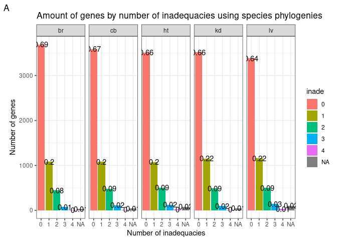
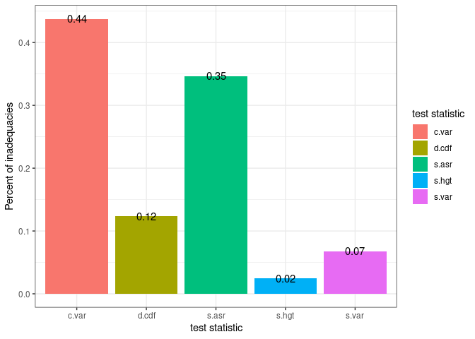
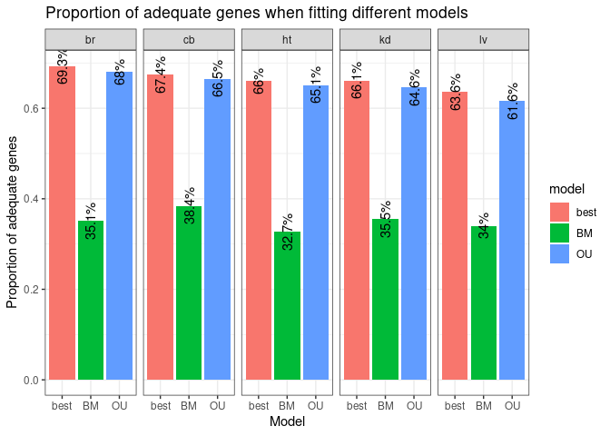

Analysis
================
Fiel Dimayacyac

## Summary of Data Set

The data set analyzed in this directory is taken from a study on gene
expression evolution among a set of 10 species across 6 different
organs. In total, they performed RNA-Seq on 5320 orthologous
genes/transcripts across these species and organs. Through a
hypothesis-testing framework, they showed that the rate of gene
expression evolution varies across organs and species due to selective
pressures. Specifically, they used hypothesis testing to determine that
different lineages (or organs) had 1: Multiple evolutionary optima and
2: Had different evolutionary optima. In this case, the null hypothesis
was an OU model, with the alternative hypothesis being a multi-optima OU
model.

<!-- -->

**Figure 1.** Number of inadequacies per gene per organ. Most genes were
adequate.

Overall, each organ had a similar pattern of inadequacies after full
analysis. 63% or more of the genes showed no inadequacies in all organs
when fitting the best-fit model, leaving 37% of genes being inadequate
when fitting their best fit models. However, interestingly none of the
models being tested account for multiple rates or multiple optima, which
the authors of the paper heavily rely on. This may suggest that a
multi-optima method may not have been necessary, but testing
multi-optima OU models would be more conclusive. Furthermore, many (but
still a minority) of the genes show higher relative fit for a simple BM
model over OU, suggesting that perhaps even models without optima at all
may be better fitting for this data set.

## Methods

------------------------------------------------------------------------

I first conducted a relative fit analysis via AIC to compare how well
each of the 3 models (BM, OU, EB) fit the data in a relative sense.
Next, I performed adequacy analysis using arbutus for the best fit model
as chosen above. I then conducted the same analysis for using just BM or
just OU to see how it affected adequacy of the data set.

## Results

------------------------------------------------------------------------

After running through relative fit analysis, each of the organs showed
similar patterns; i.e., that once again OU was the best fitting model
most of the time, but BM models are the best-fitting almost as often as
OU models are.


**Figure 2.** Relative fit (left) and absolute adequacy (right) of the
best fit model for brain tissue. Other tissues show similar patterns.

As shown by the relative and absolute measures of adequacy above, OU
models are relatively the best fit, but many data sets are best fit by
BM. Overall, most inadequacies are in two test statistics: “c.var” and
“s.asr”. C.var accounts for rate heterogeneity, suggesting that a model
that allows heterogeneous evolutionary rates may be more adequate. In
the future, this could mean measuring the adequacy of a multirate BM
model, or multirate OU model. S.asr accounts for trait variation
relative to size of the trait. For example, if a gene is showing high
expression, does it change a lot, or a little relative to size.

Next, I wanted to understand how many of the inadequacies in the data
set are from C.var and S.asr respectively.

<!-- -->

**Figure 3.** Proportion of inadequacies belonging to each test
statistic. C.var was responsible for most of the inadequacies.

As shown by the plot above, c.var and s.asr account for almost 80% of
the inadequacies. This means that finding a model that addresses both of
these factors is imperative.

Finally, due to BM data sets showing a relatively high count of genes in
which it is the best fit model, I wanted to compare the absolute
adequacy of fitting purely BM, OU, or best fit models and see how
important the evolutionary optima and alpha parameters are for this
dataset.

``` r
figure4
```

<!-- -->

**Figure 4.** Proportion of adequate genes from fitting each model to
the data, by organ.

As shown by the figure above, BM models lose large amounts of adequacy,
even though they represent the best fit model for a large portion of
data sets. Interestingly, OU models do not lose much adequacy compared
to best-fit models, suggesting that even when the BM model is the
best-fit, the OU model is good enough most of the time. Overall this
shows the importance of the optima and constraint parameters of the OU
model.

## Conclusion

------------------------------------------------------------------------

Analysis of this data set reveals that none of the 3 used models (BM,
OU, or EB) were fully adequate for the data for any of the organs, but
that OU model is mostly good. An improvement over the OU model would
then be an OU model with multiple rates, and perhaps multiple optima, as
shown by the inadequacies in specifically c.var and s.asr.
