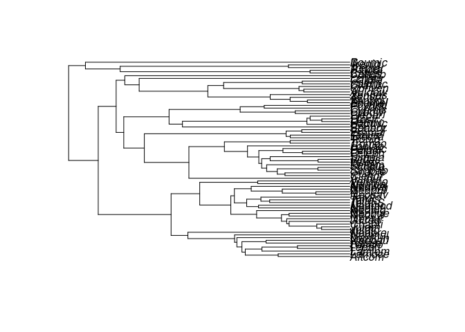

# Analysis of African Cichlid Fishes Data Adequacy

------------------------------------------------------------------------

## Introduction

The data set is taken from a
[paper](https://www.nature.com/articles/s41559-020-01354-3) studying
gene expression data in six different organs for 73 species of African
Cichlid found in Lake Tanganyika. Specifically, the paper analyzes the
expression patterns of both protein-coding genes and lncRNA to study the
evolutionary dynamics associated with the rapid adaptive radiation known
from these fish.They find that the rate of gene expression evolution
varies between organs, and that the noncoding transcripts (lncRNA)
evolve faster than coding transcripts. Interestingly, they also found
that the rate of evolution accelerated later rather than earlier.
Lastly, they used model fitting between EB, OU, and BM data to suggest
that most of this evolution was dominated by stabilizing selection, with
OU acting as the proxy for stabilizing selection. I will be analyzing
this data set to see if that last point stands by testing the adequacy
of each of those models for this data set.

## Summary Analysis

``` r
figure1
```

<!-- -->

**Figure 1: Using the best-fit model (chosen by AIC) shows a very low
adequacy overall.** A) Total adequacy for long-non-coding RNA. B) Total
adequacy for protein-coding genes. Adequacy overall is very low, with
genes being only 4% adequate for lncRNA and 24% for protein-coding
genes.

Overall it seems like the best-fit models did not adequately capture the
data in neither lncRNA nor protein coding genes, suggesting that other
model(s) may be needed.

## Results

### Initial Arbutus Analysis

**Figure 2. Relative fit (left) and absolute fit (right) of the
protein-coding genes.** Overall, a OU model fits the data the best in a
relative sense, and in an absolute sense the best-fit model is quite
inadequate. C.var, d.cdf, and s.asr show meaningful inadequacy.


**Figure 3. Relative fit (left) and absolute fit (right) of the lncRNA
genes.** Overall, a OU model fits the data the best in a relative sense,
and in an absolute sense the best-fit model is very inadequate. C.var,
d.cdf, s.asr, and s.var show meaningful inadequacy.

Similarly to what the original paper found, most genes seemed to fit an
OU model the best for both protein-coding and lncRNA genes. However, in
an absolute sense the best fit models had high and very high numbers of
inadequacies to protein-coding and lncRNA genes respectively. Because
these inadequacies were related to c.var and s.asr, I hypothesize that a
muti-rate BM model will better describe the data.

``` r
library(ape)
tree <- read.tree("expression_data_and_trees/intree")
plot(tree)
```

<!-- -->

However, to perform fitting using a BMS model, selective regimes need to
be defined. In this case, I will use selective regimes following the
ancestral history of these species. Using other information regarding
the lifestyles of these fish may be more accurate and I will attempt to
try that in the future. For my first BMS analysis, I will define
selective regimes by cichlid “tribes”.
