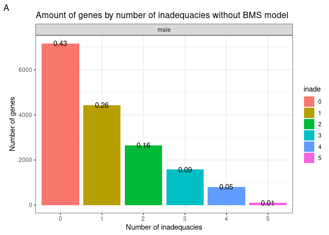
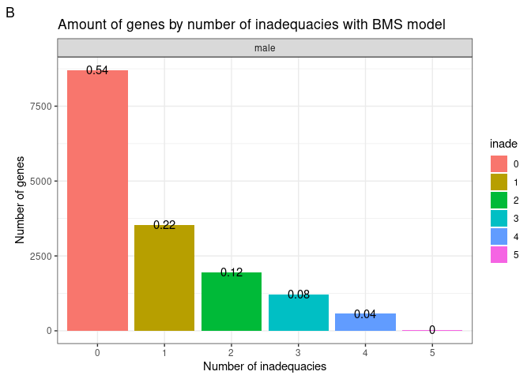
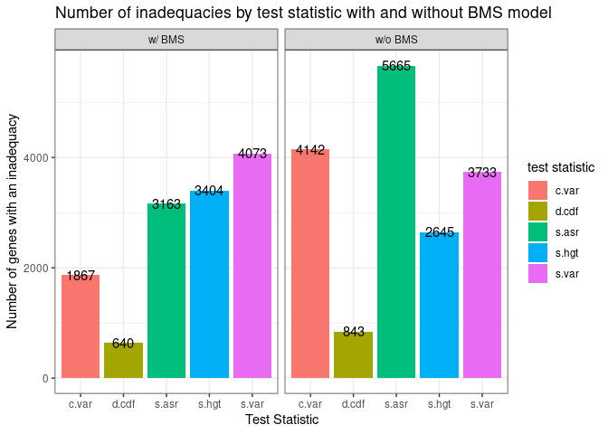

# Analysis of Extremophile Fishes Data Adequacy

------------------------------------------------------------------------

## Introduction

The data set is taken from a
[paper](https://www.biorxiv.org/content/10.1101/2021.12.13.472416v1.full)
studying transcriptomes in gill tissue of a genera of fishes, where 10
of the species have colonized pools high in sulfides. The paper
primarily leverages the EVE model (which is an extension of OU) to study
gene expression shifts between taxa that live in sulfide-rich waters and
those that do not. They found that the degree of “convergence” in gene
expression was higher not in species that were closely related, but
those that live in similar environments. This suggests that convergent
evolution of gene expression is occurring. This analysis aims to uncover
if the phylogenetic models at hand are adequate for the data set.

## Summary Analysis

<!-- --><!-- -->

**Figure 1: Using the best-fit model (chosen by AIC) shows a low
adequacy for the data set. A)** Without the addition of a multi-rate
Brownian Motion model shows less than half of genes being fully
adequate. **B)** The addition of a multi-rate Brownian Motion model
increases the adequacy of the data set to just over half.

Overall, the data set shows inadequacies in multiple test-statistics. 20
fish species are included, with 16740 genes overall.

## Results

### Initial Arbutus Analysis

**Figure 2. Relative fit (left) and absolute fit (right) of the data
without inclusion of a BMS model.** Overall, a BM model fits the data
the best in a relative sense, and in an absolute sense the best-fit
model shows problems in all test statistics except for d.cdf.

After initial analysis, I hypothesized that adding a multi-rate model to
the analysis would increase the fit of the data, due to inadequacies in
s.asr, s.var, s,hgt, and c.var which were shown to have increased values
under 0.05 when the true model is BMS and a single-rate model is fit in
my other analysis (Analysis of Multirate models in the Arbutus
Exploration folder). In addition, the paper that the data stems from
studied rate-shifts between different lineages depending on environment.

For the multi-rate Brownian Motion analysis, regimes have to be set that
signify differences in mutation rate. Due to the paper’s analysis of
fish gene expression differences due to environmental factors (living in
a high-sulfur habitat or not), I set selection regimes to follow the
habitat patterns of the fish. The tree below illustrates this.

**Figure 3. Phylogenetic tree of species included in this analysis.
Species with “S” signify that this species lives in a sulfur-rich
environment, with “NS” signifying they do not.** Tips labeled “S” were
considered one selective regime, with “NS” being another.

I then performed relative and absolute fit analysis in line with the
previous analysis displayed in Figure 2 but allowing a BMS model to be
included.

**Figure 4. Relative fit (left) and absolute fit (right) of the data
with inclusion of a BMS model.** Overall, the BMS model fits the data
the best in a relative sense, and in an absolute sense the best-fit
model shows problems in all test statistics except for d.cdf. However,
compared to Figure 2, it seems that inadequacies in the coefficient of
variation (c.var) have decreased.

Overall it seems that the new, multi-rate model fits the data better in
a relative sense, and seems to cause changes in inadequacies.
Specifically, it causes less issues with c.var. I then wanted to analyze
what changes were causing the overall adequacy to increase when using a
BMS model; what was the BMS model adding to the absolute fit?

<!-- -->

**Figure 5. Number of inadequacies in the data set by test statistic.**
Addition of BMS model decreased the number of inadequacies due to c.var
and s.asr drastically. Slight increases in s.hgt and s.var, with d.cdf
staying approximately equal.

Addition of the BMS model decreased the inadequacies of the data (when
using the best-fit model overall) by decreasing issues with C.var and
S.asr; which are both related to rate variation. Interestingly, it
seemed to increase issues with S.var and S.hgt. Still, overall adequacy
of the models for the data set increased with this addition. Relative
fit of BMS by AIC also seems to indicate that the BMS model was not too
complex as to break the assumptions of AIC, suggesting that BMS models
are better overall than the single-rate models used previously.
